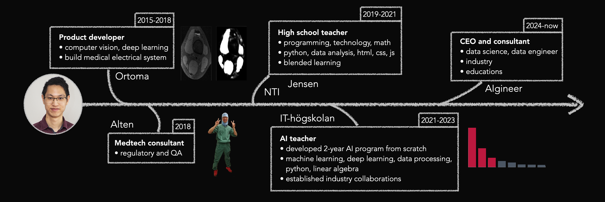

# kokchun giang :man_teacher:

I am a passionate data engineer, data scientist and AI teacher who loves working with data and creating valuable insights to aid people and organisations.

You can see my working experience timeline in the figure above.

<!-- ## AI teacher

As a  to inspire students in pursuing the beauty of programming and mathematics. To do this successfully, I am always sharpening my technological and pedagogical skillsets. My pedagogical strategy is based on a combination of **structure** from special pedagogy and clear **visualization** from engineering. The main idea behind this, is that clear structure and visualization are a neccessity for some, but beneficial for all.

My lectures during programming courses mostly consist of code-alongs where I do live coding in class and the students follow along either physically in class or virtually via Discord, where I stream the lecture. There are also students following along through watching my recorded videos. For teaching theoretical concepts in machine learning, deep learning and math courses such as linear algebra I use a digital pen with a whiteboard software that is also streamed in Discord and recorded.

I also work with portfolio inspired pedagogics, where the students continuosly work with improving their portfolio throughout our courses. For the portfolio we start working with Git and GitHub in all courses, committing and pushing their work to their repositories. By doing this, they have a well-documented record of what they have done and learned in my courses. This is valuable both for the individual as they can follow their own learning progress, as well as for potential employers to concretely see what they have learned.
 -->
<!--
## this is my toolchain

 -->

## check out my github portfolio :briefcase:

You can use my course materials on my Github to learn various topics within data science and data engineering.

| repository                            | description                                                              |
| ------------------------------------- | ------------------------------------------------------------------------ |
| [Data warehouse lifecycle][dwh]       | teaching snowflake, dlt, dbt, streamlit, dimensional modeling            |
| [Data platform course][data_platform] | teaching kafka, streaming data to live dashboard, docker, postgres       |
| [Data modeling course][model]         | teaching OLTP data modeling, normalization, keys, relational model       |
| [Data engineering][data_eng]          | teaching bash, docker, airflow, data pipelines                           |
| [Deep learning][dl]                   | teaching deep learning algorithms, including computer vision and NLP     |
| [Machine learning][ml]                | teaching shallow machine learning algorithms, mainly supervised learning |
| [Data analysis][data_analysis]        | teaching data processing and visualisation focusing on Pandas            |
| [Python programming][pytprog]         | teaching Python, fundamentals, OOP, git, github                          |
| [Linear algebra][lin_alg]             | teaching linear algebra                                                  |

[data_platform]: https://github.com/AIgineerAB/data_platform_course
[model]: https://github.com/AIgineerAB/data_modeling_course
[dwh]: https://github.com/AIgineerAB/data_warehouse_course
[data_eng]: https://github.com/kokchun/Data-engineering-AI22
[dl]: https://github.com/kokchun/Deep-learning-AI21
[ml]: https://github.com/kokchun/Machine-learning-AI22
[pytprog]: https://github.com/kokchun/Python-course-AI22
[data_analysis]: https://github.com/kokchun/Databehandling-AI22
[prog1]: https://github.com/NTI-Kronhus/TE19CD-PRRPRR01
[lin_alg]: https://github.com/kokchun/Linjar-algebra-21

## here are some deployed projects :open_file_folder:

These are some projects I've deployed to the public.

| project                             | description                                                                                                         |
| ----------------------------------- | ------------------------------------------------------------------------------------------------------------------- |
| [YH dashboard :bar_chart:][yh_stat] | dashboard showing KPIs for higher vocational education. The aim is for educational providers to be more data-driven |

[yh_stat]: https://yh-dashboard-2022-ec090093dc66.herokuapp.com/

## learn with me, my videos :movie_camera:

This is a selection of video materials that I have produced/participated in (not a full list). I have recorded all my lectures with theory and code-alongs, but don't show them here.

| Video                                                   | Description                                               |
| ------------------------------------------------------- | --------------------------------------------------------- |
| [Data platforms video series][dp_yt]                    | video series on data platforms course with streaming data |
| [Data warehouse lifecycle course video series ][dwh_yt] | video series on data warehouse lifecycle                  |
| [Database SQL with DuckDB course][duck]                 | video series on SQL with DuckDB                           |
| [GAIA][gaia]                                            | speaking about building a 2-year data science education   |

[duck]: https://www.youtube.com/watch?v=z3ihUI6N-tg&list=PLpHkXU1Ab_H_noHDIOIBWPgcewu3-LH4C
[dp_yt]: https://www.youtube.com/watch?v=Hf1ryX3dryg&list=PLpHkXU1Ab_H9c1TqK-TkiP7XayBPHyiLt
[dwh_yt]: https://www.youtube.com/watch?v=x9AyMOVAtV4&list=PLpHkXU1Ab_H_QR1Erq2VDUj16cVAEe9dq
[gaia]: https://www.youtube.com/watch?v=Gs3C_60NGQ8
[ma3c_fakt]: https://www.youtube.com/watch?v=wVneS4Akh9I

## my formal educations :books:

Here are some courses and education programs I've studied that are most relevant to my current field of work.

| :blue_book:                             | :school:              | :calendar: |
| --------------------------------------- | --------------------- | ---------- |
| AI organisations, value, implementation | AI Sweden             | 2024       |
| Biomedical engineering (MSc)            | Chalmers university   | 2015-2017  |
| Engineering mathematics (BSc)           | Chalmers university   | 2012-2015  |
| Teachers education program              | Gothenburg university | 2019-2020  |

---

## contact me :iphone:

- [: LinkedIn][linkedin]

[linkedin]: https://www.linkedin.com/in/kokchungiang/
