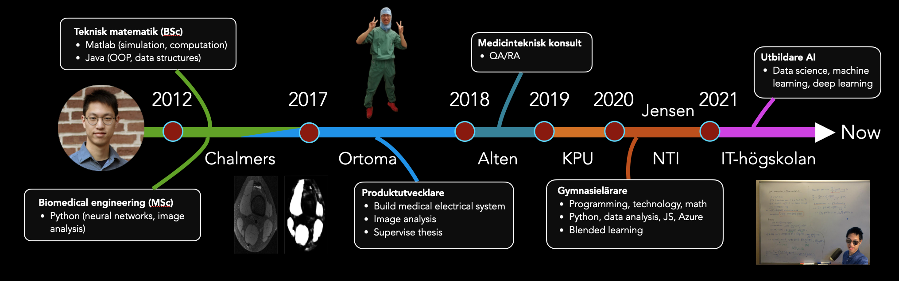

  - [GitHub portfolio](#github-portfolio)
  - [Videos](#videos)
  - [Contact me](#contact-me)

# Kokchun Giang
I am a passionate engineer and teacher who strive to inspire students in pursuing the beauty of programming and mathematics. To do this successfully, I am always sharpening my technological and pedagogical skillsets. My pedagogical strategy is based on a combination of **structure** from special pedagogy and clear **visualization** from engineering. The main idea behind this, is that clear structure and visualization are a neccessity for some, but beneficial for all.

## GitHub portfolio 

| Repo                               | Description                            |
| ---------------------------------- | -------------------------------------- |
| [Python programming][pytprog]      | introduction course                    |
| [Data analysis][data_analysis]     | course focusing on Pandas              |
| [Course plans 20/21][course_plans] | programming and math plans (gymnasiet) |
| [Programmering 1][prog1]           | first programming course (gymnasiet)   |

[pytprog]: https://github.com/kokchun/Programmering-med-Python
[data_analysis]: https://github.com/kokchun/Databehandling
[course_plans]: https://github.com/kokchun/Planeringar-2020-2021 
[prog1]: https://github.com/NTI-Kronhus/TE19CD-PRRPRR01

## Videos
This is a selection of video materials that I have produced (not a full list). 

| Video                                 | Description                                 |
| ------------------------------------- | ------------------------------------------- |
| [Kanban][kanban_react]                | a simple Kanban board using React (Swedish) |
| [Faktorer och nollställen][ma3c_fakt] | video lecture on calculus (Swedish)         |
| [Video CV 2019][cv_prezi]             | CV created in [Prezi][prezi] (Swedish)      |

[kanban_react]: https://drive.google.com/file/d/1-45bAeX-TuQXE0SVtcIDO_85qHSqGEmW/view?usp=sharing
[ma3c_fakt]: https://www.youtube.com/watch?v=wVneS4Akh9I
[cv_prezi]: https://www.youtube.com/watch?v=Xipc6YAtjTc&t=1s
[prezi]: https://prezi.com/

## Contact me 
- [: LinkedIn][linkedIn]

- :email: kokchungiang@gmail.com 

[linkedIn]: https://www.linkedin.com/in/kokchungiang/

<!-- 
 My journey started with studying [Engineering mathematics (BSc)][tekmat] followed by [Biomedical engineering (MSc)][biomed] at Chalmers University. After working in medtech industry with R&D, product development and regulatory affairs, I decided to go into the world of education. 

[tekmat]: https://www.chalmers.se/sv/utbildning/program-pa-grundniva/Sidor/Teknisk-matematik.aspx

[biomed]: https://www.chalmers.se/en/education/programmes/masters-info/Pages/Biomedical-engineering.aspx

[ortoma]: https://ortoma.com/

 -->